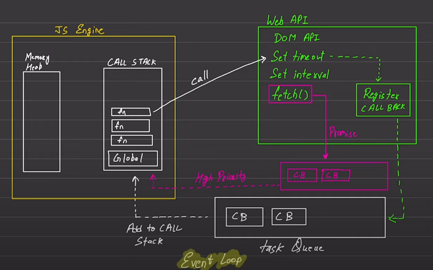

# IMPORTANT FOR INTERVIEWS
## Lecture own notes
Default: Javascript is Synchronous language,means executes code line by line at a time & single-threaded language,does all the work on single thread making it slow,but doesn't let that feel as Javascript engine is always there with runtime environment

### Talk about execution context
Each operation waits for the last one to complete before executing using call stack & memory heap

## Blocking Code Vs Non-Blocking Code
Block the flow of program & read file synchronously(waits till the all requests coming before are met) whereas non-blocking code does not block the execution & reads file asynchronously.

Note: task queue is the main thing that makes javascript fast
 

 Register Callback registers the events based on your given conditions.

 Task queue adds all callbacks in callstack.

 Promise queue does same work as task queue but it has extra concept of higher priority
 
## Expanded notes

Default: JavaScript is a synchronous language, meaning it executes code line by line, one task at a time. It is a single-threaded language — all code runs on a single thread, which could make it slow, but JavaScript doesn't let you feel that due to the help of its engine and the runtime environment (like browsers or Node.js).
Talk about Execution Context
Each operation waits for the last one to complete before executing. This is managed using the call stack and memory heap.

    Memory Heap: where variables and objects are stored.

    Call Stack: keeps track of function calls and the current point of execution.

Types of Execution Context:

    Global Execution Context – created once when the JS engine starts.

    Function Execution Context – created every time a function is invoked.

    Eval Execution Context – created by eval(), but rarely used.

Blocking Code Vs Non-Blocking Code
Blocking Code:

    Executes synchronously.

    Blocks further execution until the current task completes.

    Example:

const data = fs.readFileSync('file.txt'); // Blocking
console.log(data);

Non-Blocking Code:

    Executes asynchronously.

    Does not block the execution of the remaining code.

    Example:

fs.readFile('file.txt', (err, data) => {
  console.log(data); // Executes later
});
console.log("This runs first");

Note: The event loop, task queue, and microtask queue are what enable JavaScript to handle asynchronous behavior.

 

-Register Callback: Web APIs (like setTimeout, fetch, etc.) register the event and start processing based on the conditions you’ve given.
-Task Queue: Once the task (like timer or HTTP response) finishes, its callback is placed in the task queue.
-Call Stack: When the stack is empty, the event loop pushes callbacks from the task queue into the call stack for execution.
-Promise Queue (a.k.a. Microtask Queue):

    Works like the task queue but has higher priority.

    Handles callbacks from:

        Promises (.then())

        async/await

        MutationObserver

➡️ Microtasks are executed before the event loop processes tasks in the task queue.
Example:

console.log("Start");

setTimeout(() => {
  console.log("setTimeout");
}, 0);

Promise.resolve().then(() => {
  console.log("Promise");
});

console.log("End");

Output:

Start
End
Promise
setTimeout

    Promise runs before setTimeout because the microtask queue (used by promises) has higher priority than the task queue (used by setTimeout).